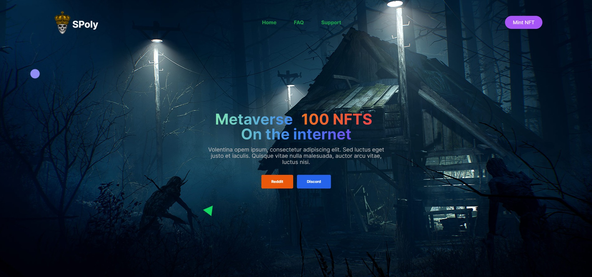

## 💀SKULLA NFT MINT DAPP - on <mark>Polygon</mark>

---

> Polygon, React, Tailwind, SCSS, ERC 721

[Visit Skulla](https://skullapolygon.netlify.app/ "Visit Skulla!") -> Polygon blockchain based NFT mint Dapp

`yarn`

`yarn dev-server`

# ERC721 NFT

## Main features
- extremely high gas efficiency (users are going to pay lower gas fees compared to traditional collections)
- whitelist support with customizable list size (using a Merkle Tree for verification)
- automated contract verification through block explorers (e.g. Etherscan)
- simple CLI commands that guide you through all the sale steps (whitelist, pre-sale, public sale)
- built as a Hardhat project with TypeScript support for a better development experience
- includes a fully-featured minting DAPP (React + TypeScript + tailwind + Webpack)
- full support for contract interaction through block explorers (e.g. Etherscan), for all the users that do not trust custom DAPPs (including the `whitelistMint(...)` function)
- customizable minting DAPP (from basic branding to complete customization)

## commands

yarn deploy --network truffle \
yarn verify 0xf8bf55a6bf9d3149984994c4430 \
yarn whitelist-open --network truffle \
yarn whitelist-close --network truffle \
yarn presale-open --network truffle \
yarn reveal --network truffle 

---

#nft #websiteMint #blockChain, #Polygon #PolygonNFTmint, #MetaMask
